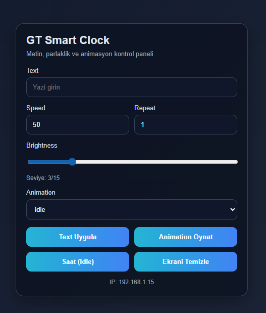

# ⏰ GT Smart Clock

**Max7219 tabanlı akıllı dijital saat projesi**

---

## 🚀 Özellikler

- 🌐 Web arayüzü üzerinden metin gönderme  
- 💡 Parlaklık kontrolü  
- 🕒 Saat gösterimi (fallback mekanizması ile)  
- 🎬 Zengin animasyon desteği  
- 📱 Mobil uyumlu modern web arayüzü  

---

## 📦 Sürüm Geçmişi

### 🆕 v1.0.1
- 🎨 Web UI ve animasyon iyileştirmeleri  
- 📱 Modern ve mobil uyumlu arayüz  

#### 🎛️ Animasyonlar
- `graphicMidline1`
- `graphicMidline2`
- `graphicScanner`
- `graphicRandom`
- `graphicFade`
- `graphicSpectrum1`
- `graphicHeartbeat`
- `graphicHearts`
- `graphicEyes`
- `graphicBounceBall`
- `graphicArrowScroll`
- `graphicScroller`
- `graphicWiper`
- `graphicInvader`
- `graphicPacman`
- `graphicArrowRotate`
- `graphicSpectrum2`
- `graphicSinewave`
- `graphicRightWink`
- `graphicLeftWink`

#### 🔘 Kontroller
- Text ve animasyon için ayrı butonlar:
  - **Text Uygula**
  - **Animation Oynat**

#### ⚡ Hızlı Aksiyonlar
- Saat (Idle)
- Ekranı Temizle  

#### ▶️ Diğer
- Tek seferlik animasyon çalışma desteği  
- Boot sırasında 5 saniyelik göz animasyonu  
- Ardından IP adresi gösterimi  

#### 🔤 Türkçe Karakter Normalizasyonu
- `ç → c`
- `ğ → g`
- `ı → i`
- `ö → o`
- `ş → s`
- `ü → u`

---

### 🟢 v1.0.0
- 🎉 İlk sürüm  
- 🌐 Web üzerinden text gönderme  
- 💡 Brightness kontrolü  
- 🕒 Clock fallback özelliği  

---

## 🛠️ Kullanılan Teknolojiler

- ESP32  
- MAX7219 LED Matrix  
- Web Server (HTTP)  
- NTP Client  

---

## 📸 Ekran Görüntüsü / Demo
  
> 

---

## ⚙️ Kurulum

1. Projeyi klonla:
```bash
git clone https://github.com/kullanici_adin/GT_Smart_Clock.git